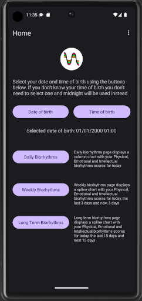
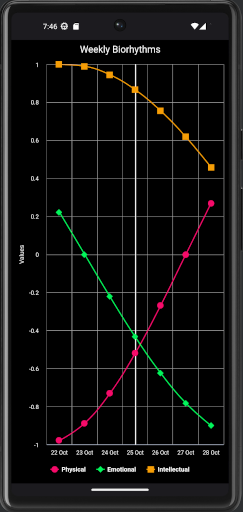
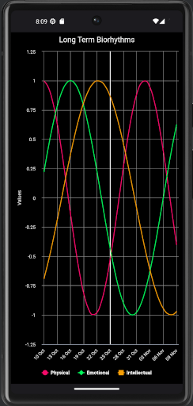

# Biorhythms Android App
## By Alex Brown

# Introduction

Personal project to implement the <a href="https://en.wikipedia.org/wiki/Biorhythm_(pseudoscience)" target="_blank">biorhythms</a> algorithm using modern Android development practises.

# Algorithm

- Physical = sin((2 * Math.PI * daysAlive) / 23)
- Emotional = sin((2 * Math.PI * daysAlive) / 28)
- Intellectual = sin((2 * Math.PI * daysAlive) / 33)

# Charting

Built using extremely flexible <a href="https://github.com/AAChartModel/AAChartCore-Kotlin" target="_blank">AAInfographics</a> chart framework.

 

    
