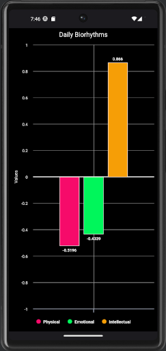

# Biorhythms Android App
## By Alex Brown

# Introduction

Personal project to implement the [biorhythms](https://en.wikipedia.org/wiki/Biorhythm_(pseudoscience)) algorithm using modern Android development practises.

# Algorithm

- Physical = sin((2 * Math.PI * daysAlive) / 23)
- Emotional = sin((2 * Math.PI * daysAlive) / 28)
- Intellectual = sin((2 * Math.PI * daysAlive) / 33)

# Charting

Built using extremely flexible [AAInfographics](https://github.com/AAChartModel/AAChartCore-Kotlin) chart framework.

 

    
